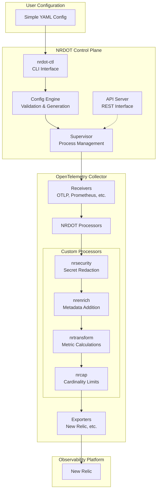

# NRDOT-HOST: New Relic Distribution of OpenTelemetry

<p align="center">
  
  
  
  
  
</p>

<p align="center">
  <b>Enterprise-grade OpenTelemetry distribution for secure, scalable infrastructure monitoring</b>
</p>

## 🎯 Overview

NRDOT-HOST provides a production-ready OpenTelemetry Collector distribution with enterprise features:

- **🔒 Security First**: Automatic secret redaction, PII protection, secure defaults
- **📊 Smart Processing**: Cardinality protection, metric calculations, metadata enrichment
- **🚀 Easy Deployment**: Single YAML config, systemd/Docker/K8s support, auto-configuration
- **🔧 Operational Excellence**: Self-monitoring, health checks, graceful degradation
- **📈 Scalable**: Handles 1M+ metrics/sec, multi-tenant support, efficient resource usage

## 🚀 Quick Start

### Install with Package Manager

```bash
# Ubuntu/Debian
curl -sSL https://github.com/deepaucksharma/nrdot-host/releases/latest/download/install.sh | sudo bash

# RHEL/CentOS
sudo yum install -y https://github.com/deepaucksharma/nrdot-host/releases/latest/download/nrdot-host.rpm

# macOS
brew tap newrelic/nrdot
brew install nrdot-host
```

### Configure

Create `/etc/nrdot/config.yaml`:

```yaml
service:
  name: my-service
  environment: production

# Your New Relic license key
license_key: YOUR_LICENSE_KEY

# Enable telemetry collection
metrics:
  enabled: true
  interval: 60s

traces:
  enabled: true
  sample_rate: 0.1

logs:
  enabled: true

# Security features
security:
  redact_secrets: true
  
# Processing features  
processing:
  enrich:
    add_host_metadata: true
  cardinality:
    enabled: true
    global_limit: 100000
```

### Start

```bash
# systemd
sudo systemctl start nrdot-host
sudo systemctl enable nrdot-host

# Docker
docker run -d \
  -v /etc/nrdot:/etc/nrdot \
  -v /var/run/docker.sock:/var/run/docker.sock:ro \
  --name nrdot-host \
  ghcr.io/deepaucksharma/nrdot-host/nrdot-collector:latest

# Kubernetes
helm install nrdot-host ./kubernetes/helm/nrdot \
  --set config.licenseKey=YOUR_LICENSE_KEY
```

## 🏗️ Architecture



## 📦 Components

### Core Components

| Component | Description | Status |
|-----------|-------------|--------|
| **[nrdot-ctl](./nrdot-ctl)** | Command-line interface for managing NRDOT | ✅ Complete |
| **[nrdot-config-engine](./nrdot-config-engine)** | Configuration validation and OTel config generation | ✅ Complete |
| **[nrdot-supervisor](./nrdot-supervisor)** | Process lifecycle management with health monitoring | ✅ Complete |
| **[nrdot-api-server](./nrdot-api-server)** | REST API for status and configuration | ✅ Complete |
| **[nrdot-schema](./nrdot-schema)** | YAML configuration schemas and validation | ✅ Complete |
| **[nrdot-template-lib](./nrdot-template-lib)** | OpenTelemetry configuration templates | ✅ Complete |

### OpenTelemetry Processors

| Processor | Description | Features |
|-----------|-------------|----------|
| **[otel-processor-nrsecurity](./otel-processor-nrsecurity)** | Security and compliance | • Secret redaction<br/>• PII detection<br/>• Compliance rules |
| **[otel-processor-nrenrich](./otel-processor-nrenrich)** | Metadata enrichment | • Cloud metadata<br/>• K8s annotations<br/>• Custom tags |
| **[otel-processor-nrtransform](./otel-processor-nrtransform)** | Metric transformations | • Aggregations<br/>• Unit conversions<br/>• Rate calculations |
| **[otel-processor-nrcap](./otel-processor-nrcap)** | Cardinality protection | • Limit enforcement<br/>• Smart sampling<br/>• Cost control |

### Supporting Components

| Component | Description | Type |
|-----------|-------------|---------|
| **[nrdot-telemetry-client](./nrdot-telemetry-client)** | Self-monitoring and health reporting | Library |
| **[nrdot-privileged-helper](./nrdot-privileged-helper)** | Secure process information gathering | Setuid Binary |
| **[otel-processor-common](./otel-processor-common)** | Shared interfaces for processors | Library |

## 🛠️ Development

### Prerequisites
- Go 1.21+
- Docker 20.10+
- Make 4.0+
- OpenTelemetry Collector Builder 0.90+

### Build Commands

```bash
# Build everything
make all

# Build specific component
make build-nrdot-ctl
make build-processors

# Run tests
make test                # All unit tests
make test-integration    # Integration tests
make test-e2e           # End-to-end tests

# Docker images
make docker-build       # Build all images
make docker-push        # Push to registry

# Development
make fmt                # Format code
make lint               # Run linters
make generate           # Generate code
```

### Component Development

```bash
# Work on a specific component
cd nrdot-ctl
go mod download
go test ./...
go build -o bin/nrdot-ctl ./cmd/nrdot-ctl

# Test with local collector
cd otelcol-builder
make build
./bin/nrdot-collector --config=../examples/basic/config.yaml
```

## 🎯 Key Features

### Security First
- **Secret Redaction**: Automatic detection and masking of credentials, API keys, passwords
- **PII Protection**: Built-in patterns for credit cards, SSNs, email addresses
- **Non-root Monitoring**: Privileged helper for secure process data collection
- **Compliance Ready**: PCI-DSS, HIPAA, SOC2 compliance rules built-in

### Operational Excellence
- **Self-Healing**: Automatic recovery from crashes with exponential backoff
- **Health Monitoring**: Real-time health metrics and KPI tracking
- **Zero Downtime**: Graceful configuration reloads and updates
- **Resource Protection**: Memory and CPU limits with circuit breakers

### Enterprise Scale
- **High Performance**: Handles 1M+ data points/sec per instance
- **Cardinality Protection**: Automatic limiting with smart sampling
- **Multi-tenancy**: Isolated configurations per service/team
- **Cost Control**: Built-in metrics to track and optimize costs

## 📊 Performance

| Metric | Value | Notes |
|--------|-------|-------|
| Throughput | 1M+ data points/sec | Per collector instance |
| Latency | < 1ms | P99 processing time |
| Memory | < 512MB | Typical usage |
| CPU | < 2 cores | At full load |
| Startup | < 5 seconds | Including health checks |

## 🚦 Status

### CI/CD
- 
- 
- 

### Component Status
- ✅ Core Components: Complete
- ✅ OpenTelemetry Processors: Complete
- ✅ CLI Interface: Complete
- ✅ Docker Support: Complete
- ✅ Kubernetes Support: Complete
- 🚧 Windows Support: In Progress
- 📋 Multi-cloud Templates: Planned

## 🤝 Contributing

We welcome contributions! See [CONTRIBUTING.md](./CONTRIBUTING.md) for guidelines.

### Development Workflow

1. Fork the repository
2. Create a feature branch (`git checkout -b feature/amazing-feature`)
3. Make your changes with tests
4. Run `make test lint` to validate
5. Commit your changes (`git commit -m 'Add amazing feature'`)
6. Push to the branch (`git push origin feature/amazing-feature`)
7. Open a Pull Request

### Code Standards
- Go 1.21+ idioms
- 80% test coverage minimum
- Linted with golangci-lint
- Documented public APIs

## 📚 Documentation

- [Installation Guide](./docs/installation.md)
- [Configuration Reference](./docs/configuration.md)
- [Processor Documentation](./docs/processors.md)
- [Troubleshooting Guide](./docs/troubleshooting.md)
- [API Reference](./docs/api.md)

## 🔒 Security

Security is our top priority. See [SECURITY.md](./SECURITY.md) for:
- Vulnerability reporting
- Security features
- Best practices
- Compliance information

## 📄 License

Licensed under the Apache License, Version 2.0. See [LICENSE](./LICENSE) for details.

## 🙏 Acknowledgments

- OpenTelemetry Community for the excellent collector framework
- New Relic Engineering for architecture guidance
- All contributors who have helped shape this project

## 🔗 Links

- [Releases](https://github.com/deepaucksharma/nrdot-host/releases)
- [Issues](https://github.com/deepaucksharma/nrdot-host/issues)
- [Discussions](https://github.com/deepaucksharma/nrdot-host/discussions)
- [New Relic Documentation](https://docs.newrelic.com)

---

<p align="center">
  Made with ❤️ by the NRDOT Team<br>
  <a href="https://newrelic.com">New Relic</a> | <a href="https://opentelemetry.io">OpenTelemetry</a>
</p>