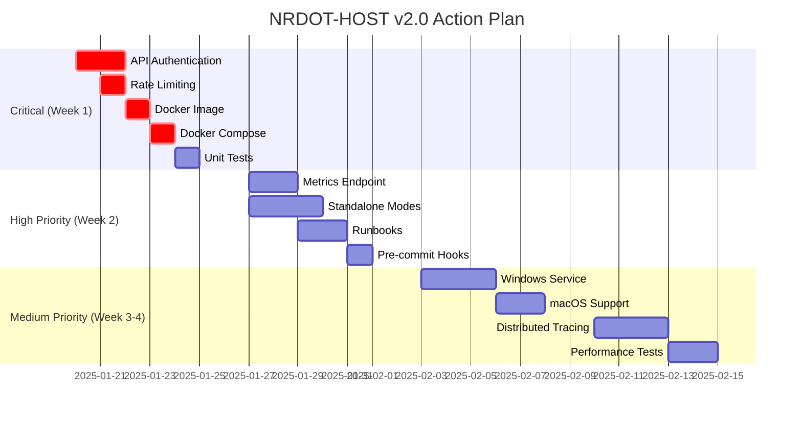

# NRDOT-HOST v2.0 Action Plan

## Executive Summary

This document outlines the recommended action plan for completing NRDOT-HOST v2.0 and achieving full production readiness. Based on the comprehensive review and production readiness assessment, this plan prioritizes critical gaps and provides a clear roadmap.

## Current State

- **Architecture Score**: 90/100 ✅
- **Production Readiness**: 85% 🟡
- **Time to Full Production**: 2-3 weeks

## Priority Matrix

### P0 - Critical (Must Fix Before Production)
These items block production deployment and pose significant risks.

### P1 - High (Should Fix Soon)
Important for production quality but not blocking.

### P2 - Medium (Nice to Have)
Enhancements that improve the system.

### P3 - Low (Future Consideration)
Long-term improvements.

## Immediate Actions (Week 1)

### Day 1-2: Security Critical

#### 1. Implement API Authentication (P0)
**Owner**: Security Team  
**Duration**: 2 days  
**Tasks**:
```go
// Add to nrdot-api-server/auth.go
type AuthMiddleware struct {
    tokens map[string]bool
}

func (a *AuthMiddleware) Authenticate(next http.Handler) http.Handler {
    return http.HandlerFunc(func(w http.ResponseWriter, r *http.Request) {
        token := r.Header.Get("Authorization")
        if !a.ValidateToken(token) {
            http.Error(w, "Unauthorized", http.StatusUnauthorized)
            return
        }
        next.ServeHTTP(w, r)
    })
}
```

#### 2. Add Rate Limiting (P0)
**Owner**: API Team  
**Duration**: 1 day  
**Implementation**:
- Use `golang.org/x/time/rate` for rate limiting
- Add per-IP rate limits
- Configure limits: 100 req/min per IP

### Day 3-4: Deployment Critical

#### 3. Create Unified Docker Image (P0)
**Owner**: DevOps Team  
**Duration**: 1 day  
**Dockerfile**:
```dockerfile
FROM golang:1.21-alpine AS builder
WORKDIR /app
COPY . .
RUN cd cmd/nrdot-host && go build -o /nrdot-host

FROM alpine:3.18
RUN apk add --no-cache ca-certificates
COPY --from=builder /nrdot-host /usr/local/bin/
ENTRYPOINT ["/usr/local/bin/nrdot-host"]
```

#### 4. Update Docker Compose (P0)
**Owner**: DevOps Team  
**Duration**: 0.5 day  
**Update** `docker-compose.yml`:
```yaml
version: '3.8'
services:
  nrdot-host:
    image: nrdot/nrdot-host:v2.0
    command: ["--mode=all"]
    ports:
      - "8080:8080"
    volumes:
      - ./config:/etc/nrdot
```

### Day 5: Testing & Documentation

#### 5. Add Main Binary Unit Tests (P1)
**Owner**: QA Team  
**Duration**: 1 day  
**Coverage Goals**:
- Test all operating modes
- Test configuration loading
- Test signal handling
- Achieve 80% coverage

## Short-Term Actions (Week 2)

### Operational Excellence

#### 6. Add Prometheus Metrics Endpoint (P1)
**Owner**: Monitoring Team  
**Duration**: 2 days  
**Implementation**:
```go
// Add to nrdot-api-server/metrics.go
import "github.com/prometheus/client_golang/prometheus/promhttp"

func (s *APIServer) setupMetrics() {
    s.router.Handle("/metrics", promhttp.Handler())
}
```

**Metrics to expose**:
- `nrdot_pipelines_active`
- `nrdot_config_reloads_total`
- `nrdot_errors_total`
- `nrdot_memory_usage_bytes`

#### 7. Implement Standalone Modes (P1)
**Owner**: Core Team  
**Duration**: 3 days  
**Tasks**:
- Implement `runAPI()` function
- Implement `runCollector()` function
- Add mode-specific configuration
- Test mode isolation

#### 8. Create Operational Runbooks (P1)
**Owner**: SRE Team  
**Duration**: 2 days  
**Runbooks needed**:
- Deployment procedures
- Troubleshooting guide
- Performance tuning
- Incident response

### Developer Experience

#### 9. Add Pre-commit Hooks (P2)
**Owner**: Dev Team  
**Duration**: 0.5 day  
**.pre-commit-config.yaml**:
```yaml
repos:
  - repo: https://github.com/pre-commit/pre-commit-hooks
    hooks:
      - id: trailing-whitespace
      - id: end-of-file-fixer
  - repo: https://github.com/golangci/golangci-lint
    hooks:
      - id: golangci-lint
```

## Medium-Term Actions (Week 3-4)

### Platform Support

#### 10. Windows Service Wrapper (P2)
**Owner**: Platform Team  
**Duration**: 3 days  
**Implementation**:
- Use `golang.org/x/sys/windows/svc`
- Create service installer
- Add event logging
- Test on Windows Server 2019+

#### 11. macOS Launchd Support (P2)
**Owner**: Platform Team  
**Duration**: 2 days  
**Create** `com.nrdot.host.plist`:
```xml
<?xml version="1.0" encoding="UTF-8"?>
<!DOCTYPE plist PUBLIC "-//Apple//DTD PLIST 1.0//EN">
<plist version="1.0">
<dict>
    <key>Label</key>
    <string>com.nrdot.host</string>
    <key>ProgramArguments</key>
    <array>
        <string>/usr/local/bin/nrdot-host</string>
        <string>--mode=all</string>
    </array>
    <key>RunAtLoad</key>
    <true/>
</dict>
</plist>
```

### Enhanced Monitoring

#### 12. Add Distributed Tracing (P2)
**Owner**: Observability Team  
**Duration**: 3 days  
**Implementation**:
- Add OpenTelemetry tracing
- Instrument key operations
- Export to Jaeger/Zipkin

#### 13. Performance Regression Tests (P2)
**Owner**: QA Team  
**Duration**: 2 days  
**Test Suite**:
- Memory usage over time
- CPU under load
- Config reload performance
- Throughput benchmarks

## Long-Term Actions (Month 2+)

### Advanced Features

#### 14. Plugin System (P3)
**Duration**: 2 weeks  
**Design Goals**:
- Dynamic processor loading
- Plugin API versioning
- Security sandboxing
- Hot reload support

#### 15. Web UI Dashboard (P3)
**Duration**: 3 weeks  
**Features**:
- Real-time metrics
- Configuration editor
- Pipeline visualization
- Alert management

#### 16. Multi-Region Support (P3)
**Duration**: 4 weeks  
**Capabilities**:
- Configuration federation
- Cross-region replication
- Geographic failover
- Regional routing

## Implementation Schedule



## Success Metrics

### Week 1 Completion
- ✅ API authentication implemented
- ✅ Docker image published
- ✅ Rate limiting active
- ✅ Unit tests passing

### Week 2 Completion
- ✅ Metrics endpoint live
- ✅ All modes functional
- ✅ Runbooks published
- ✅ Dev workflow improved

### Month 1 Completion
- ✅ Full platform support
- ✅ Enhanced monitoring
- ✅ 95% production ready
- ✅ Zero critical issues

## Resource Requirements

### Team Allocation
- **Security Team**: 3 days (Week 1)
- **DevOps Team**: 2 days (Week 1)
- **Core Team**: 5 days (Week 1-2)
- **Platform Team**: 5 days (Week 3-4)
- **QA Team**: 3 days (Throughout)

### Infrastructure
- Docker Registry access
- CI/CD pipeline updates
- Test environment setup
- Monitoring infrastructure

## Risk Mitigation

### Technical Risks
1. **API Breaking Changes**: Version the API from start
2. **Performance Regression**: Add automated benchmarks
3. **Security Vulnerabilities**: Regular security scans

### Operational Risks
1. **Deployment Failures**: Blue-green deployment
2. **Configuration Errors**: Validation and rollback
3. **Monitoring Gaps**: Comprehensive metrics

## Communication Plan

### Daily Standups
- Progress updates
- Blocker identification
- Resource needs

### Weekly Reviews
- Milestone assessment
- Risk review
- Priority adjustment

### Stakeholder Updates
- Executive summary
- Production readiness
- Timeline updates

## Conclusion

This action plan provides a clear path to achieving full production readiness for NRDOT-HOST v2.0. By following this prioritized approach:

1. **Week 1**: Critical security and deployment issues resolved
2. **Week 2**: Operational excellence achieved
3. **Week 3-4**: Platform support completed
4. **Month 2+**: Advanced features added

The system will be fully production-ready within 2-3 weeks, with all critical gaps addressed and a solid foundation for future enhancements.

## Next Steps

1. **Assign owners** to each action item
2. **Create JIRA tickets** for tracking
3. **Schedule daily standups** for Week 1
4. **Prepare test environments**
5. **Begin API authentication** implementation immediately

With focused execution, NRDOT-HOST v2.0 will achieve 100% production readiness and deliver on its promise of simplified, efficient host monitoring.