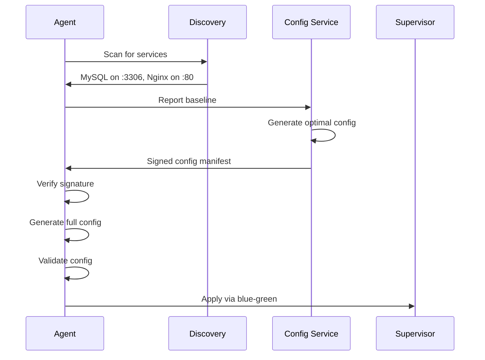

# NRDOT-HOST Architecture

## Overview

NRDOT-HOST is New Relic's next-generation Linux telemetry collector built on OpenTelemetry. This document describes the v2.0 unified architecture and the evolution roadmap for intelligent auto-configuration.

## Architectural Evolution

### Current State (v2.0) - Unified Architecture
- **Single binary** deployment with embedded components
- **Direct function calls** replacing IPC
- **Blue-green reload** strategy as default
- **Linux-optimized** design (though still builds for other platforms)

### Roadmap (4-month timeline)
- **Phase 1**: Enhanced process monitoring via /proc (4 weeks)
- **Phase 2**: Auto-configuration with service discovery (6 weeks)
- **Phase 3**: GA with migration tools (4 weeks)

See [Roadmap](../roadmap/ROADMAP.md) for detailed timeline.

## Architecture Components

### 1. Core Binary (`nrdot-host`)

The Linux-optimized binary that serves as both the current unified agent and future auto-configuring collector:

```bash
# Default: All components in one process
nrdot-host --mode=all

# Agent only: Collector without API
nrdot-host --mode=agent

# API only: Management interface
nrdot-host --mode=api
```

### 2. Core Components

#### Unified Supervisor
- Embeds API server, config engine, and collector management
- Direct function calls between components
- Shared memory state
- Single telemetry client

```go
type UnifiedSupervisor struct {
    configEngine  *configengine.EngineV2    // Embedded
    apiServer     *http.Server              // Embedded
    collector     *CollectorProcess         // Managed
    telemetry     *telemetryclient.Client   // Shared
}
```

#### Config Engine v2
- Consolidated schema validation and template generation
- In-memory config generation (no file dependencies)
- Version history and rollback support
- Direct integration with supervisor

```go
type EngineV2 struct {
    validator *schema.Validator      // Internal package
    generator *templates.Generator   // Internal package
    versions  []models.ConfigVersion // In-memory history
}
```

#### Common Module (`nrdot-common`)
- Shared data structures across all components
- Provider interfaces for clean contracts
- Centralized error handling
- Consistent serialization

### 3. Reload Strategy

The architecture uses **Blue-Green reload** exclusively:

1. Start new collector process with new config
2. Verify health of new collector
3. Switch internal references to new collector
4. Gracefully stop old collector
5. Zero downtime configuration updates

This is the only supported reload mechanism, ensuring reliability and consistency.

## Data Flow

### Current Configuration Flow
```
User YAML → ConfigEngine.Validate() → ConfigEngine.Generate() → Supervisor.Apply()
```

### Future Auto-Configuration Flow
```
Host Scan → Service Discovery → Baseline Upload → Remote Config Fetch → 
  → Template Selection → Pipeline Generation → Automatic Apply
```

### Status/Health Flow
```
Collector → Supervisor.GetStatus() → API.HandleStatus() → HTTP Response
```

### Dynamic Reload Flow
```
Config Change Detected → Validation → Blue-Green Deploy → Health Check → Commit/Rollback
```

## Linux Deployment Scenarios

### 1. Standard Linux Host (Primary Use Case)
```bash
# Install via package manager
sudo apt install nrdot-host
# or
sudo yum install nrdot-host

# Systemd service (auto-enabled)
[Service]
ExecStart=/usr/bin/nrdot-host --mode=all
User=nrdot
PrivilegesRequired=CAP_SYS_PTRACE,CAP_DAC_READ_SEARCH
```

### 2. Container Deployment (Docker)
```bash
docker run -d \
  --name nrdot-host \
  --network host \
  --pid host \
  --privileged \
  -v /proc:/host/proc:ro \
  -v /sys:/host/sys:ro \
  -v /etc:/host/etc:ro \
  newrelic/nrdot-host:latest
```

### 3. Future: Migration from Infrastructure Agent (Phase 3)
```bash
# Coming in Phase 3
sudo nrdot-host migrate-infra
# - Detect existing newrelic-infra
# - Convert configuration format
# - Migrate license key  
# - Preserve custom attributes
# - Validate metrics continuity
```

## v2.0 Architecture Benefits

### 1. Simplified Deployment
- Single binary (vs. multiple components)
- Direct function calls (no IPC)
- Unified configuration

### 2. Resource Efficiency
- Shared memory state
- Single telemetry client
- Reduced context switching

### 3. Operational Reliability
- Blue-green reload strategy
- No component version mismatches
- Simplified troubleshooting

### 4. Performance (Current)
- Memory: ~300MB (unified binary)
- CPU: 2-5% idle
- Startup: ~3 seconds

## Configuration Evolution

### Current: Manual Configuration (v2.0)
```yaml
# /etc/nrdot/config.yaml
service:
  name: my-host
  environment: production
  
license_key: YOUR_LICENSE_KEY

# Manual service configuration required
receivers:
  hostmetrics:
    collection_interval: 60s
  mysql:  # Must be manually configured
    endpoint: localhost:3306
    username: monitoring
    password: ${env:MYSQL_PASSWORD}
```

### Future: Auto-Configuration (Phase 2)
```yaml
# /etc/nrdot/config.yaml - Minimal config
service:
  name: my-host
  
license_key: YOUR_LICENSE_KEY

# Auto-config will:
# 1. Discover MySQL on :3306
# 2. Report to New Relic
# 3. Receive optimal config
# 4. Apply automatically
```

## Implementation Status

### Implemented (v2.0)
- ✅ Unified binary with embedded components
- ✅ Blue-green reload strategy
- ✅ Custom processors (nrsecurity, nrenrich, nrtransform, nrcap)
- ✅ Host metrics and logs collection
- ✅ OTLP gateway functionality

### Not Yet Implemented
- ❌ Auto-configuration engine
- ❌ Service discovery mechanisms
- ❌ Remote configuration client
- ❌ Enhanced process telemetry
- ❌ Migration tools

See [Roadmap](../roadmap/ROADMAP.md) for implementation timeline.

## Future: Auto-Configuration Architecture (Phase 2)

### Service Discovery Engine

The discovery engine uses multiple methods to reliably detect services:

```go
type ServiceDiscovery struct {
    ProcessScanner   *ProcessScanner  // Scan /proc for running processes
    PortScanner      *PortScanner     // Check listening ports via /proc/net
    ConfigLocator    *ConfigLocator   // Find service config files
    PackageDetector  *PackageDetector // Query dpkg/rpm databases
    PrivilegedHelper *Helper          // Elevated access via setuid helper
}
```

**Discovery Methods:**
- Process name matching (mysqld → MySQL)
- Port mapping (3306 → MySQL)
- Config file detection (/etc/mysql/ → MySQL)
- Package queries (dpkg -l mysql-server)
- Correlation for high confidence

### Configuration Generation Pipeline

```go
type ConfigPipeline struct {
    TemplateRenderer *TemplateRenderer // Convert templates to config
    ConfigValidator  *ConfigValidator  // Schema and policy validation
    ConfigSigner     *ConfigSigner     // Cryptographic signatures
    DeliveryEngine   *DeliveryEngine   // Fetch and apply configs
}
```

**Template System:**
- Service templates in `templates/integrations/`
- Common components in `templates/common/`
- Variable substitution from discovery data
- Embedded in binary for reliability

### Remote Configuration Flow



### Cryptographic Signing

- **Algorithm**: ECDSA P-256
- **Backend**: Signs configs with private key
- **Agent**: Verifies with embedded public key
- **Future**: Optional Cosign integration

See [Auto-Configuration Technical Spec](../auto-config/AUTO_CONFIGURATION_TECHNICAL.md) for complete details.

## Linux Platform Design

### 1. Privileged Helper (Implemented)
- Setuid binary for elevated operations
- Main process runs as non-root
- Unix socket communication
- Limited to specific safe operations

### 2. Process Monitoring (Phase 1)
- Direct `/proc` filesystem parsing:
  - `/proc/[pid]/stat` for CPU/memory
  - `/proc/[pid]/status` for metadata
  - `/proc/[pid]/cmdline` for full command
- Top-N tracking by CPU and memory
- Service pattern matching for discovery
- Parent-child relationship mapping
- No eBPF for maximum compatibility

### 3. Resource Collection
- Host metrics via OpenTelemetry hostmetrics receiver
- Log collection via filelog receiver
- Custom processors for enrichment

## Security Model

### Current Implementation (v2.0)
1. **Process Isolation**: Runs as nrdot user
2. **Secret Redaction**: nrsecurity processor
3. **TLS 1.3**: To New Relic endpoints
4. **Privileged Helper**: Basic implementation

### Phase 2 Security Enhancements
1. **Config Signing**: ECDSA signatures on all configs
2. **Capability Model**:
   - `CAP_SYS_PTRACE`: Process inspection
   - `CAP_DAC_READ_SEARCH`: Config file access
3. **Credential Management**: Environment variables only
4. **Fail-Closed**: Reject unsigned/invalid configs

### Phase 3 Additions
1. **API Authentication**: JWT/API key support
2. **Secrets File**: Encrypted credential storage
3. **Package Signing**: Agent binary signatures

## Performance

### Current (v2.0)
- **Memory**: ~300MB (unified binary)
- **CPU**: 2-5% idle usage
- **Startup**: ~3 seconds
- **Config Reload**: <100ms (blue-green)

### Target (Phase 3 GA)
- **Memory**: <150MB
- **CPU**: <2% idle
- **Process Discovery**: <5 seconds
- **Service Detection**: <30 seconds

## Platform Notes

### Linux-Only Focus
While v2.0 still includes cross-platform build targets, the roadmap focuses exclusively on Linux:
- Phase 0 includes removing Windows/macOS code
- All new features are Linux-specific
- No Kubernetes operator planned
- Traditional host monitoring only

### What's Being Removed
- Windows/macOS build targets
- Kubernetes-specific features
- Container runtime monitoring
- Cross-platform abstractions