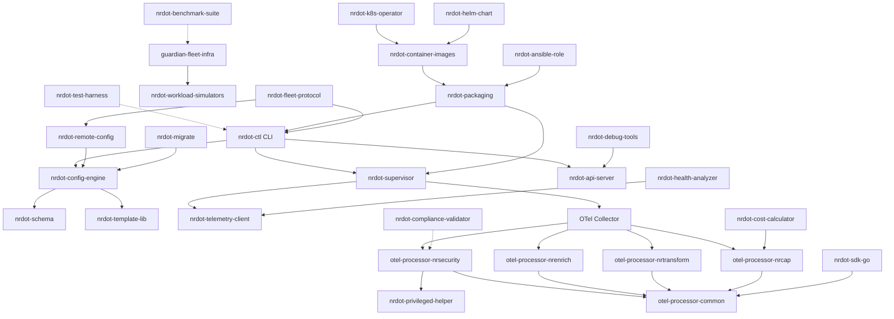

# NRDOT-Host Component Dependencies

## Dependency Graph

## Integration Points

### Core Dependencies
- **nrdot-ctl** depends on: config-engine, supervisor, telemetry-client, api-server
- **config-engine** depends on: schema, template-lib
- **supervisor** depends on: telemetry-client

### Processor Dependencies  
- All processors depend on: otel-processor-common
- nrsecurity processor depends on: privileged-helper (for non-root mode)

### Testing Dependencies
- test-harness validates all components
- guardian-fleet-infra deploys workload-simulators
- compliance-validator specifically tests security processors

### Deployment Dependencies
- packaging bundles core components
- container-images packages for Docker/K8s
- k8s-operator and helm-chart deploy container-images
- ansible-role deploys packages

### Tool Dependencies
- migrate reads/writes config-engine formats
- debug-tools connects to api-server
- sdk-go extends processor-common
- health-analyzer analyzes telemetry-client data
- cost-calculator works with nrcap processor data